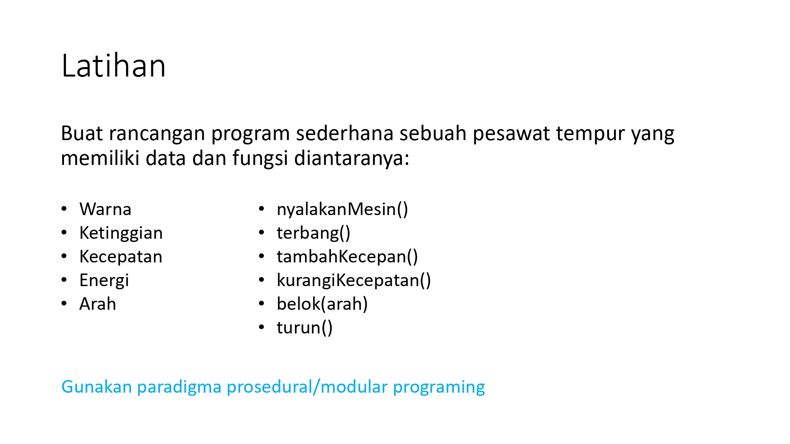

# Pemograman-Orientasi-Objek_latihan1
 
<h1>Pesawat Tempur Sederhana</h1>
Program sederhana ini mensimulasikan sebuah pesawat tempur dengan fungsi-fungsi dasar menggunakan paradigma prosedural/modular dalam bahasa pemrograman Java.

<h2>Soal</h2>

<h3>Data Pesawat</h3>

Program ini menyimpan data pesawat tempur berikut:  
Warna: Warna pesawat. 
Ketinggian: Ketinggian pesawat dari permukaan tanah. 
Kecepatan: Kecepatan pesawat. 
Energi: Tingkat energi yang dimiliki pesawat. 
Arah: Arah hadap pesawat (misalnya: Utara, Selatan, Timur, Barat). 

<h3>Fungsi Pesawat</h3>

Program ini menyediakan fungsi-fungsi berikut untuk mengontrol pesawat:

nyalakanMesin(): Menyalakan mesin pesawat. 
terbang(): Membuat pesawat terbang. 
tambahKecepatan(): Menambah kecepatan pesawat. 
kurangiKecepatan(): Mengurangi kecepatan pesawat. 
belok(arah): Merubah arah pesawat ke arah yang ditentukan. 
turun(): Menurunkan ketinggian pesawat. 
status(): Menampilkan status pesawat.
 

<h1>Cara Penggunaan</h1>

Pastikan Anda telah menginstal Java Development Kit (JDK) di sistem Anda.
Jalankan program dengan mengetikkan perintah javac PesawatTempur.java pada terminal atau command prompt untuk mengkompilasi program.
Jalankan program dengan mengetikkan perintah java PesawatTempur pada terminal atau command prompt untuk menjalankan program.
Program akan menampilkan status awal pesawat.
Anda dapat mengontrol pesawat dengan memanggil fungsi-fungsi yang tersedia.

<h1>Contoh Penggunaan</h1>

<h2>java</h2>

Verify

Open In Editor
Edit
Copy code
// Menyalakan mesin pesawat
nyalakanMesin();

// Menambah kecepatan pesawat
tambahKecepatan();

// Merubah arah pesawat ke utara
belok("Utara");

// Menurunkan ketinggian pesawat
turun();

// Menampilkan status pesawat
status();
